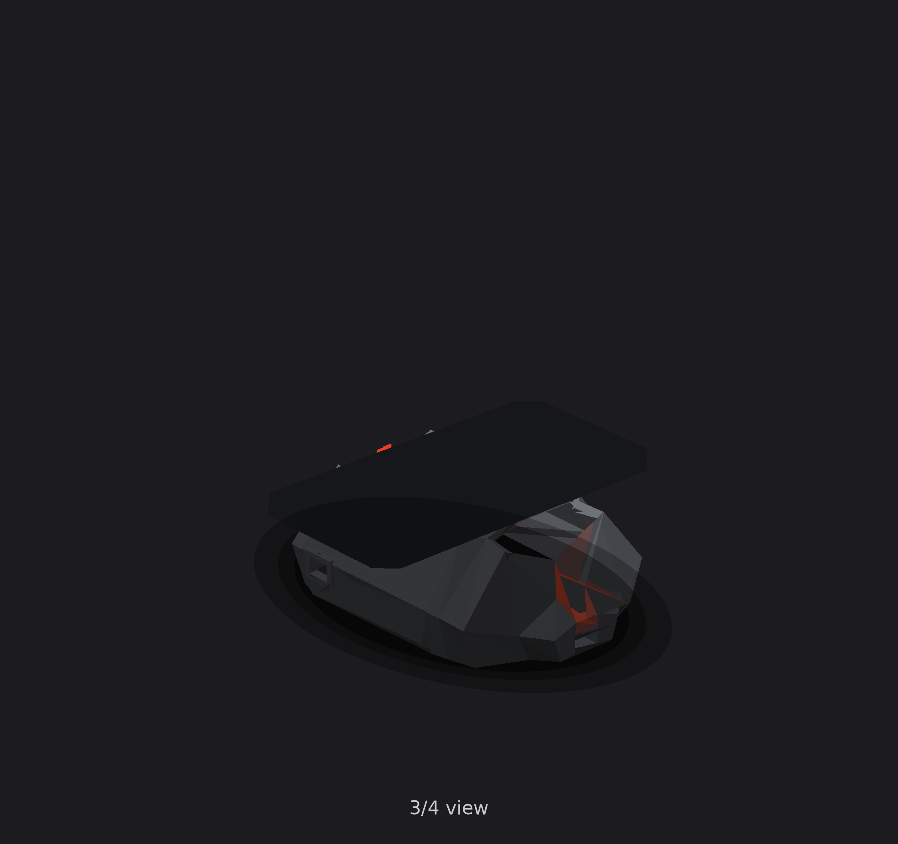
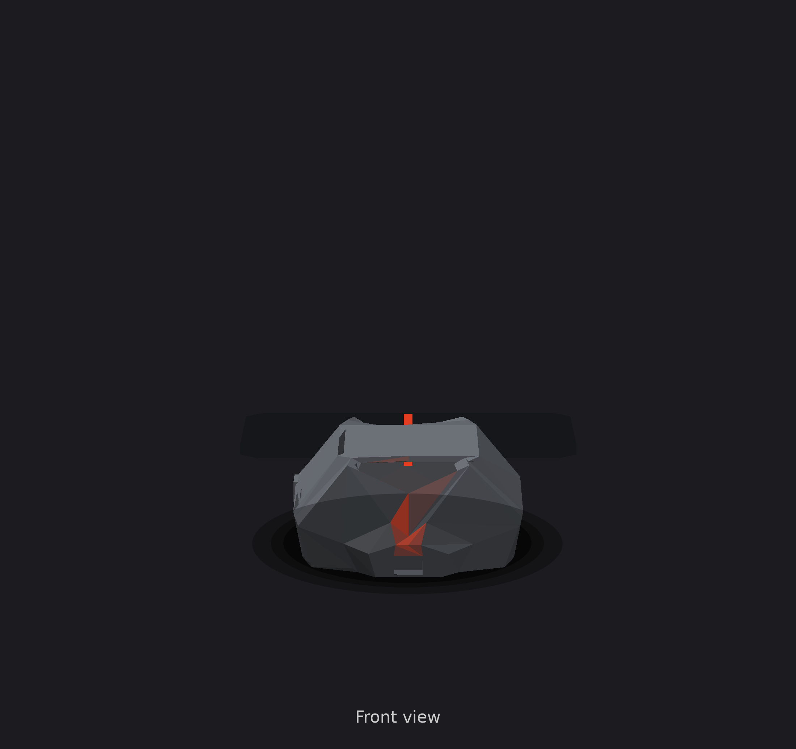
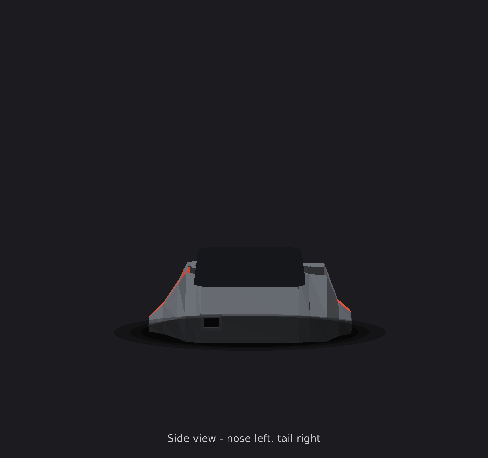
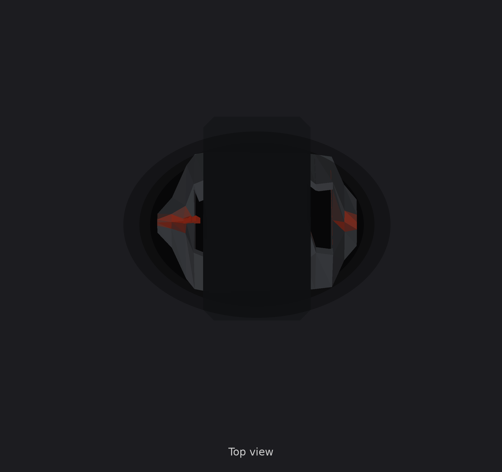

# Handlebar Demo Enclosure — v5 "dragon shield"

Team Hero · UXDG 340

Concept massing study, not manufacturing-ready. Third major direction after
the faceted dragonhead/spinefin merge (v3) and a fully smooth sculpted pass
(v4). This version comes from a specific reference image: dark gunmetal,
angular faceted shield shape, a glowing red V-seam down the centerline,
small dragon-fin accents near the nose.

## What's in this version

- **Angular faceted shield body** — back to hard facets (not v4's smooth
  curves), reusing the proven 7-point groove cross-section from v3.
- **Sharp V-ridge down the centerline**, deepest right before the mounting
  pad, giving the aggressive "face" read from the reference. Rendered with
  a glowing red/orange seam along the groove.
- **Two small fins near the nose**, echoing the reference's "ridge detail:
  small fins for a dragon-like silhouette."
- **Dark gunmetal body / near-black plate**, matching the reference's
  material instead of the earlier tan/bronze PLA look.
- **Generic flat mounting plate for the actual bars** — not the specific
  riser/clamp hardware shown in the reference image, which was unrelated
  stock photography. Plate is 100 × 190mm, bolt holes left undrilled per
  spec (mark and drill once the real clamps are in hand).

## Bugs found and fixed (two rounds)

1. **Plate rotated 90° by mistake** (copied from an earlier version where
   that rotation dodged a different set of fins). Put the plate's long
   190mm dimension along the body's length — hanging off both the nose
   and tail — instead of across the body for the bar clamps. Fixed before
   the first Rhino handoff.
2. **Fins floating with a visible gap underneath** (caught from Rhino
   screenshots after printing/viewing the first dragon-shield pass). Root
   cause: the fin's base was anchored to `az`, the ridge height out at
   `y=±rw` — but the fins sit centered at `y=0`, which is the *bottom* of
   the V-notch, not the ridge. At the fin's actual position, the true
   surface is 18-22mm lower than `az` (`az - groove`). The fin's base was
   floating in mid-air that whole distance. Fixed by anchoring to
   `az - groove` instead, and increased fin height (9/11mm → 26mm) so the
   tips still clear the now-correctly-lower base and poke up past the
   surrounding ridge.

## Cavity sizing - verified, not just assumed

Spec requires >=130 x 85 x 40mm of usable interior. The gross
`INNER_X_RANGE` length (126mm) looked close enough at a glance, but
checking every station individually (half-width at the 40mm height the
components need) showed the two hollow-region boundary stations, plus one
in the middle, actually pinched down to 25-63mm wide there - well under
the 85mm needed. Fixed by widening the ridge at those three stations
(wider/taller, same groove depth, so the V-notch look is unchanged) and
re-verified: **every** station across the full 130mm hollow span (36mm to
166mm) now individually clears 85mm width at 40mm height, not just the
two endpoints. See `generate_enclosure.py`'s station comments for the
before/after numbers.

External envelope is unaffected by either fix: still 190 × 133 × 62mm,
inside the spec's 190 × 135 × 70 recommendation and every printer bed
listed in spec.md.

## Numbers

| | Value |
|---|---|
| Body mass (PLA) | 255g |
| Body cost @ $22/kg | $5.61 |
| Body bbox | 190 × 133 × 62mm |
| Cavity | 130mm long, >=85mm wide and >=40mm tall at every station in that span |
| Plate mass if printed | 140g — recommend plywood/acrylic instead |
| Overhang checker | 35.9% of downward-facing area flagged |
| Fin overhang angles | both fins 15.3°/7.3° (well under the 45° limit) |

Body alone is well under the 300g budget.

## About that 190×190×66.6mm Rhino BoundingBox reading

If you ran Rhino's `BoundingBox` command with `Cumulative=Yes` over both
solids, it measures the *plate* too - and the plate is deliberately
190mm wide (spans past the body) so two bar clamps have something to
bolt to, per spec section 7: "wider than the enclosure... a separate
plate solves this." The **body alone** is 190 × 133 × 62mm, matching the
spec's recommended envelope. Select just the body mesh before running
BoundingBox if you want the enclosure's own dimensions.

## Honest gaps

1. **Scale texture from the reference isn't modeled.** Real 3D scales at
   that density would mean hundreds of tiny raised bumps — print-prohibitive
   at this scale and not worth the wall-thickness/print-time cost. A
   textured spray paint or vinyl wrap would get the same visual effect
   physically. Spec itself says scales aren't required.
2. **The red glow is a render effect, not geometry** — it's just how the
   groove faces are colored in the preview. In Rhino, assign those
   centerline faces a separate emissive/red material if you want the same
   look (see the print statement at the end of `rhino_build_enclosure.py`).
3. **Not slicer-checked.** The 35.9% overhang number is a simple
   face-angle heuristic, not a real slice — check actual bridging before
   printing.
4. **USB port position (x=60mm, left wall) is still a placeholder** — spec
   says decide the Uno's orientation first.
5. Bar overall width is unconfirmed for the actual 7/8" clamp set (see
   spec.md's correction note), so the plate's 190mm span is a reasonable
   guess, not a measured fit.

## Files

- `generate_enclosure.py` — Python/trimesh generator
- `rhino_build_enclosure.py` — same geometry, pure RhinoCommon, builds
  directly into an open Rhino document (no pip installs needed)
- `render.py` — gunmetal/red-glow preview renderer
- `body.stl`, `top_plate.stl` — current output meshes
- `renders/` — preview images
- `spec.md` — the team's build spec (one correction applied: section 7 bar
  diameter, see git history)
- `PROJECT.md` — team/project context
