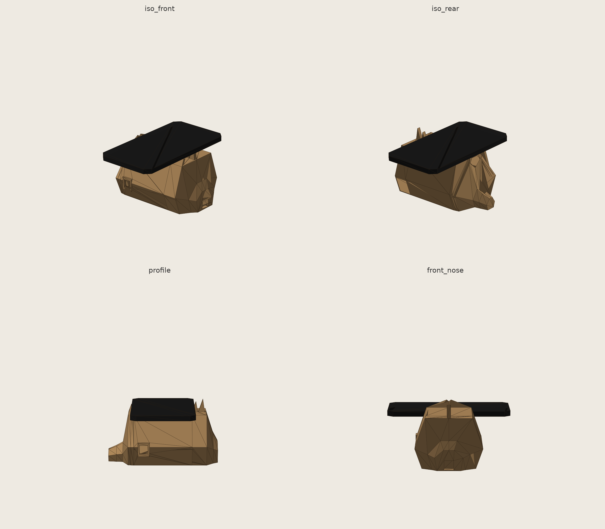
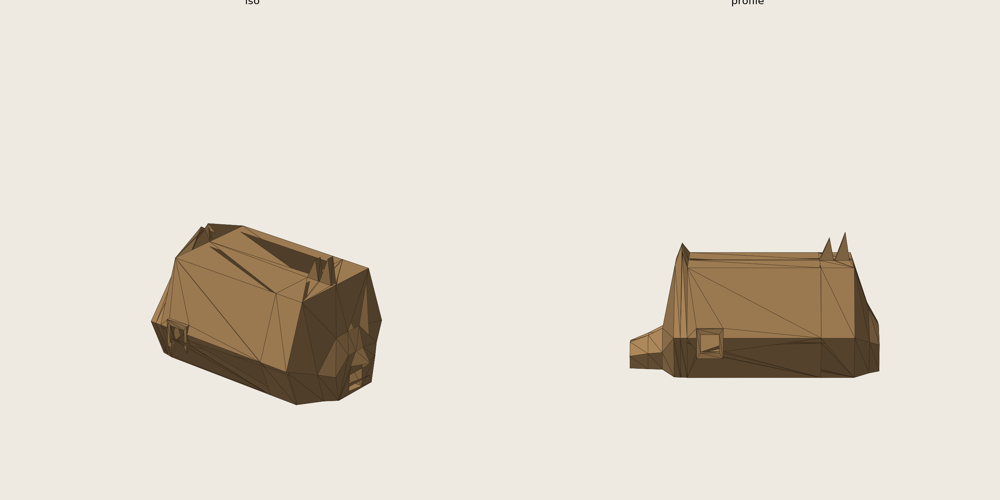

# Handlebar Demo Enclosure — v3

Team Hero · UXDG 340

Concept massing study, not manufacturing-ready. Built from a 4-way parallel
design pass (dragon-head nose, spine fins, scaled flanks, clawed haunches),
then merged the two that actually worked.

## What's in this version

- **Slim snout up front** (dragon-head candidate): nose tapers into one
  dramatic brow flare with a centerline groove, then a sharp horn, before
  flattening into the top pad.
- **Twin dorsal fins at the rear** (spine-fin candidate): flank the pad on
  the tail side, both faces well under the 45° overhang limit (32°/15° and
  27°/12°).
- **Dropped**: scaled-flank candidate (the "scales" turned out to actually
  perforate the wall — daylight visible through the side in the render, not
  a shallow texture) and clawed-haunches (broken, asymmetric spike cluster,
  didn't read as a creature foot at all).
- **USB port has a real bezel now.** Earlier version had it as a bare
  floating rectangular hole — this one computes the hull's actual surface
  offset at the cut location so the frame genuinely stands proud.

## Numbers

| | Value |
|---|---|
| Body mass (PLA) | 212g |
| Body cost @ $22/kg | $4.66 |
| Body bbox | 190 × 116 × 74mm |
| Cavity | 135 × 90 × 56mm (target: 130 × 85 × 40) |
| Top plate mass if printed | 170g — **recommend plywood/acrylic instead**, per spec section 7 |
| Overhang checker | 38.1% of downward-facing area flagged |

Body alone is well under the 300g budget. If the plate is also printed,
212 + 170 = 382g, over budget — another reason to cut it from plywood or
acrylic like the spec suggests.

## The overhang number isn't what it looks like

38% sounds bad. It isn't a flaw in this candidate — it's inherent to the
brief's own constraints taken together: the cavity has no floor (spec
section 6), and the top pad has to be genuinely flat (spec section 6). That
combination means the pad's underside is open air with nothing under it in
the printed-and-assembled orientation. The overhang checker (a simple
face-normal-angle test) correctly flags that flat span, but a flat
horizontal span is a **bridge**, not a support-needing overhang — slicers
handle those differently (cooling + speed, not supports). Ran the
unmodified baseline through the same checker and got 40.5%, confirming
this is baked into the shape the spec asks for, not something this
iteration introduced.

Real, disclosed risk: the pad spans roughly 90-100mm as an unsupported
bridge. That's at the edge of what PLA bridges cleanly without supports.
Worth a test print of just the pad region before committing to the full
part, and worth checking your slicer's bridging settings (fan speed, flow).

## Files

- `generate_enclosure.py` — Python/trimesh generator (edit `STATIONS` to
  change the taper, `FIN_SPECS` for the fins)
- `rhino_build_enclosure.py` — same geometry, pure RhinoCommon, builds
  directly into an open Rhino document (no pip installs needed)
- `render.py` — shaded preview renderer
- `body.stl`, `top_plate.stl` — current output meshes
- `renders/` — preview images
- `spec.md` — the team's build spec (one correction applied: section 7 bar
  diameter, see git history)

## Still open / not verified

1. **Not slicer-checked.** The overhang number above is a heuristic, not a
   real slice. Check actual bridging and any steep facets before printing.
2. **USB port position is still a placeholder** (x=62mm on the left wall).
   Spec says decide the Uno's orientation first — that hasn't happened yet.
3. **Horn/brow read is subtle** at this low-poly scale — closer to
   "snouted tank" than unambiguously "dragon." Noted honestly by the agent
   that built it; a sharper topology change (not just reshaping one
   cross-section) would be needed to push further.
4. Bar clamp bolt pattern, exact facet count/sharpness, and whether a
   display mounts on top are all still open per spec section 8.
