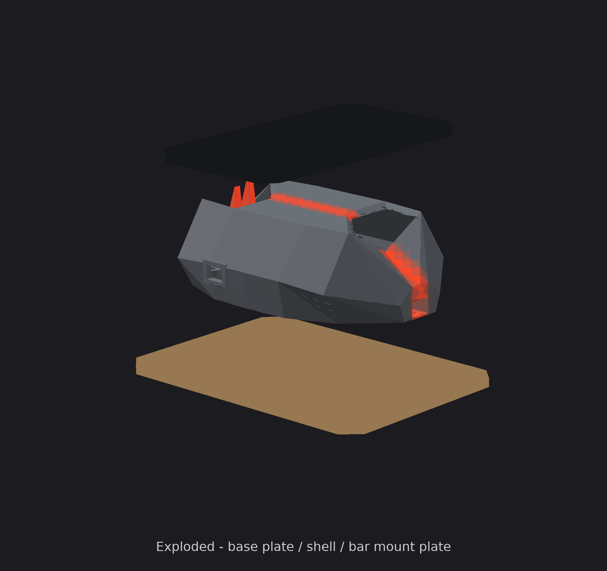
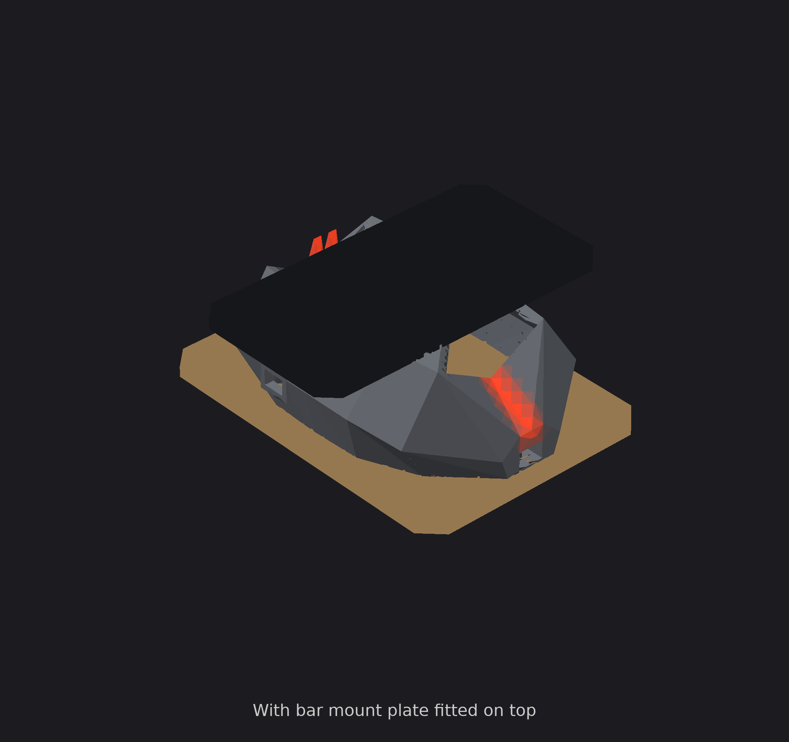
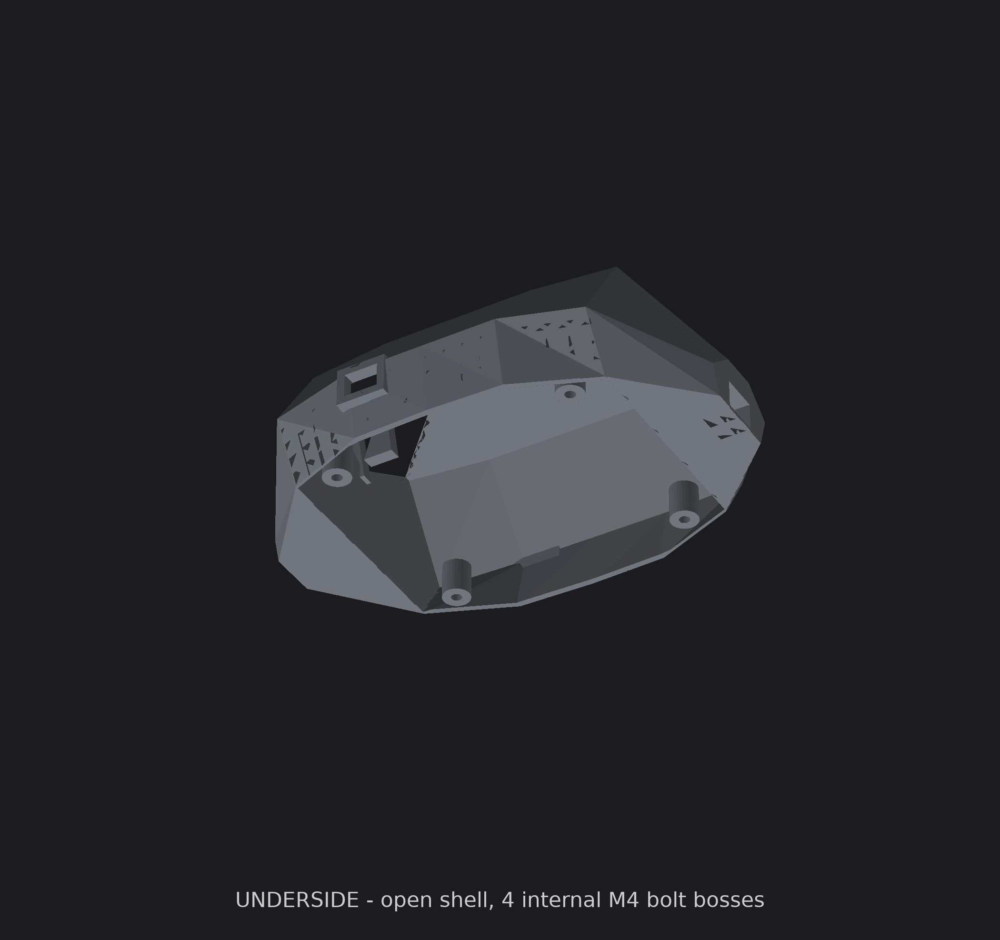

# Handlebar Demo Enclosure — v6

Team Hero · UXDG 340

Concept massing study, not manufacturing-ready. Same dark-gunmetal faceted
shield direction as v5 (glowing red V-seam, small dragon fins near the
nose), rebuilt from scratch to fix three things that were wrong with it:
it wasn't symmetric, the facets were irregular, and it had no bottom.

## The three fixes

### 1. Symmetry

v5 read lopsided because the USB bezel stuck out 2mm on the −Y side only.
Both flanks now get an identical bezel; the +Y one is a blind recess 2.5mm
deep, so it looks the same from outside without breaching the wall. The
generator checks this numerically rather than by eye: mirroring the finished
mesh across Y and differencing the volume gives **0.0000 mm³**, and the
±Y extents match to the decimal (66.66 / −66.66).

### 2. Even facets

v5's stations were spaced 4 / 10 / 90mm apart with the shape parameters
jumping around between them, so facet sizes were all over the place — that's
the "wonky geometry" read. v6 uses seven evenly spaced stations (~31mm
apart) with a smooth monotonic progression, mirror-symmetric fore and aft
apart from the nose being deliberately lower and sharper than the tail.

### 3. A bottom

**The spec contradicts itself here, and that's worth flagging to the team.**
Sections 6 and 8 say "opens downward, no floor" and "no separate base plate
needed." But section 7's structural warning says to "use a real bike stem
bolted through to a plywood base with the printed enclosure as a shell
around it." Those can't both be true — handlebar load has to go somewhere,
and a floorless shell has nothing to react against.

v6 follows section 7: the shell stays open-bottomed (so the Arduino drops in
from below and the print needs no internal supports), but it now bolts down
to a flat base plate through **four internal M4 bosses** at
(46, ±43) and (144, ±43). Base plate is 206 × 150 × 6mm plywood or acrylic.

An external bolt flange was tried first and rejected: it pushed width to
142mm (spec caps 135mm) and mass to 323g (budget is 300g). Internal bosses
add neither.

## Cavity sizing — verified, not assumed

Spec requires ≥130 × 85 × 40mm of usable interior. Gross span looks fine at
a glance but says nothing about the pinch points, so the generator checks
the half-width at the 40mm height **at every station** in the hollow range:

| Station (x) | Half-width @ z=40 | Ceiling | |
|---|---|---|---|
| 30 | 43.0mm | 55.0mm | PASS |
| 64 | 49.2mm | 55.0mm | PASS |
| 95 | 49.2mm | 55.0mm | PASS |
| 126 | 49.2mm | 55.0mm | PASS |
| 160 | 43.0mm | 55.0mm | PASS |

Required is 42.5mm half-width (85mm full). Hollow span is 130mm exactly.

## Numbers

| | Value |
|---|---|
| Body mass (PLA) | 281g |
| Body cost @ $22/kg | $6.18 |
| Body bbox | 190 × 133 × 69mm |
| Cavity | 130mm long, ≥85mm wide and ≥40mm tall at every station |
| Top plate | 100 × 190 × 6mm — plywood/acrylic, 140g if printed |
| Base plate | 206 × 150 × 6mm — plywood/acrylic, 4 × M4 |
| Overhang checker | 36.0% of downward-facing area flagged |
| Fin overhang angles | 17.1°/8.7° and 15.9°/8.1° (limit 45°) |

Body is under the 300g budget and inside the 190 × 135 × 70 envelope.

## Reading the renders

One model, six camera angles — not six designs. The exploded view is the
clearest: plywood base plate at the bottom, printed shell in the middle,
bar mount plate on top. "Mounted" shows the top plate actually fitted, which
hides most of the shell — that's why the other views leave it off.

## If you run BoundingBox in Rhino

Select **only** the body mesh. Both plates are deliberately wider than the
shell (the top one so the bar clamps have something to bolt to, per spec
section 7), so a cumulative bounding box over all three reports the plates'
size, not the enclosure's.

## Honest gaps

1. **Scale texture from the reference isn't modeled.** Real 3D scales at
   that density would be hundreds of tiny raised bumps — print-prohibitive
   and not worth the print-time cost. Textured spray paint or a vinyl wrap
   gets the same effect physically. Spec says scales aren't required.
2. **The red glow is a render effect, not geometry.** In Rhino, assign the
   centerline groove faces an emissive red material for the same look.
3. **Not slicer-checked.** The 36% overhang figure is a face-angle
   heuristic, not a real slice — check actual bridging before printing.
4. **USB port position (x=70mm) is still a placeholder** — spec says decide
   the Uno's orientation first. The +Y side is a blind recess, so only the
   −Y side is a real opening; swap which one is cut if the Uno faces the
   other way.
5. **Bar overall width is unconfirmed** for the actual 7/8" clamp set (see
   spec.md's correction note), so the top plate's 190mm span is a reasonable
   guess, not a measured fit.
6. **Bolt holes in the top plate are undrilled**, per spec — mark and drill
   once the real clamps are in hand.

## Files

- `generate_enclosure.py` — Python/trimesh generator, prints the symmetry
  and cavity checks above every run
- `rhino_build_enclosure.py` — same geometry in pure RhinoCommon, builds
  straight into an open Rhino document (no pip installs). Safe to re-run;
  it deletes its own previous objects first.
- `render.py` — gunmetal/red-glow preview renderer
- `body.stl`, `top_plate.stl`, `base_plate.stl` — current output meshes
- `renders/` — preview images
- `spec.md` — the team's build spec (one correction applied: section 7 bar
  diameter, see git history)
- `PROJECT.md` — team/project context
